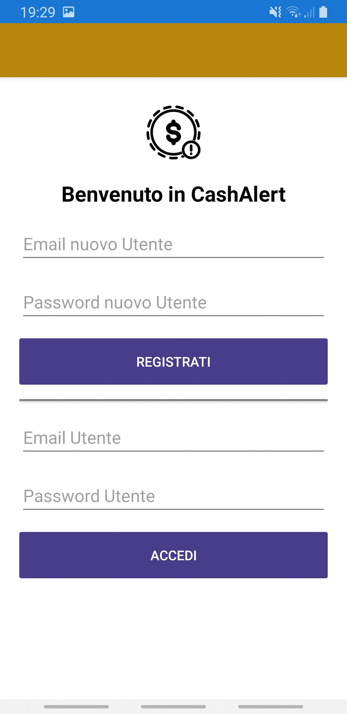

# CashAlert
App per Mobile Computing
------

Un applicazione molto minimal per memorizzare tutte le spese che si fanno nella vita giornaliera, impostare un limite massimo di soldi che ci si vuole imporre e visualizzare tutte le spese effettuate giorno per giorno con un calcolo dell'effettivo totale. 

## Built with
* [Firebase](https://firebase.google.com/)
* [Xamarin.Essentials](https://docs.microsoft.com/xamarin/essentials/?WT.mc_id=friends-0000-jamont)
* [Xamarin.Forms](http://xamarin.com/forms)

## Misc

Lisences under MIT

Space Needle icon by [Pravin Unagar via The Noun Project](https://thenounproject.com/icon/money-alert-642808/)
