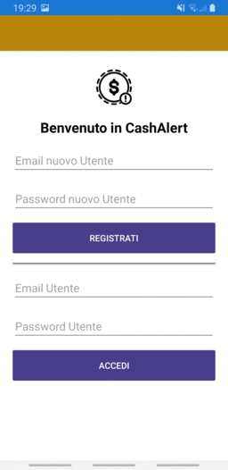

# CashAlert
App per Mobile Computing
------

Un applicazione di semplice utilizzo per tenere sempre d'occhio le uscite dal proprio portafoglio e gestire così al meglio le proprie disponibilità mensili.
Sono previste diverse funzioni:
-  memorizzare tutte le spese del giorno con importo e motivazione;
-  impostare un tetto massimo delle spese giornaliere con un alert al superamento;
-  visualizzare tutte le spese effettuate in ciascuna giornata con indicazione della tipologia di acquisto ed evidenza del totale complessivo.

## Screenshots

  

## Built with
* [Firebase](https://firebase.google.com/)
* [Xamarin.Essentials](https://docs.microsoft.com/xamarin/essentials/?WT.mc_id=friends-0000-jamont)
* [Xamarin.Forms](http://xamarin.com/forms)

## Misc
Space Needle icon by [Pravin Unagar via The Noun Project](https://thenounproject.com/icon/money-alert-642808/)

## Project by Riccardo Scudieri
